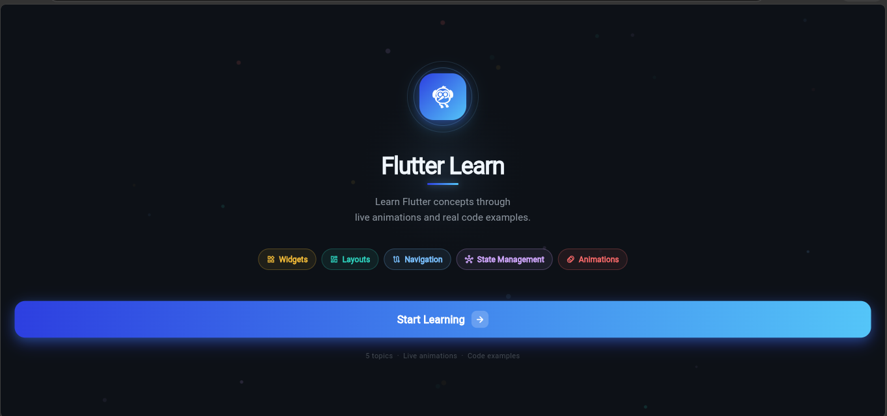
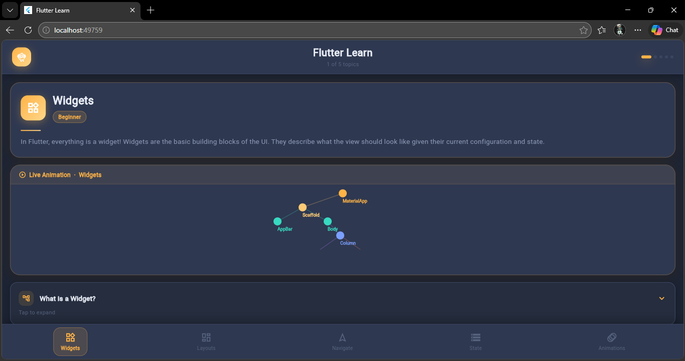
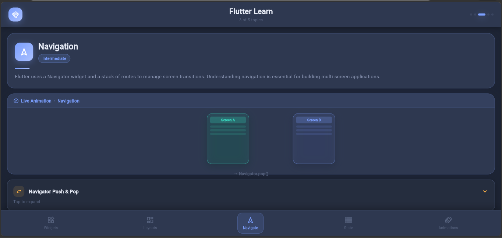
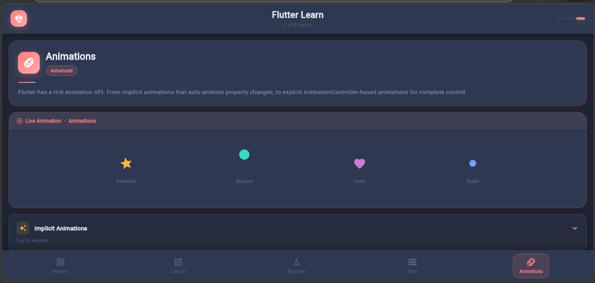
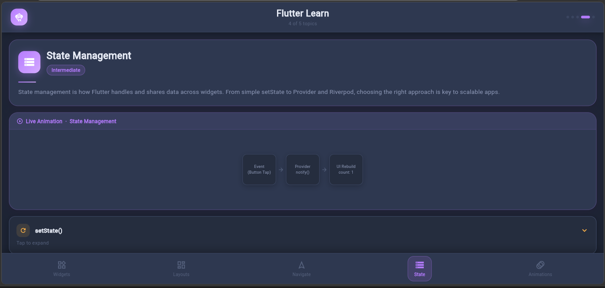
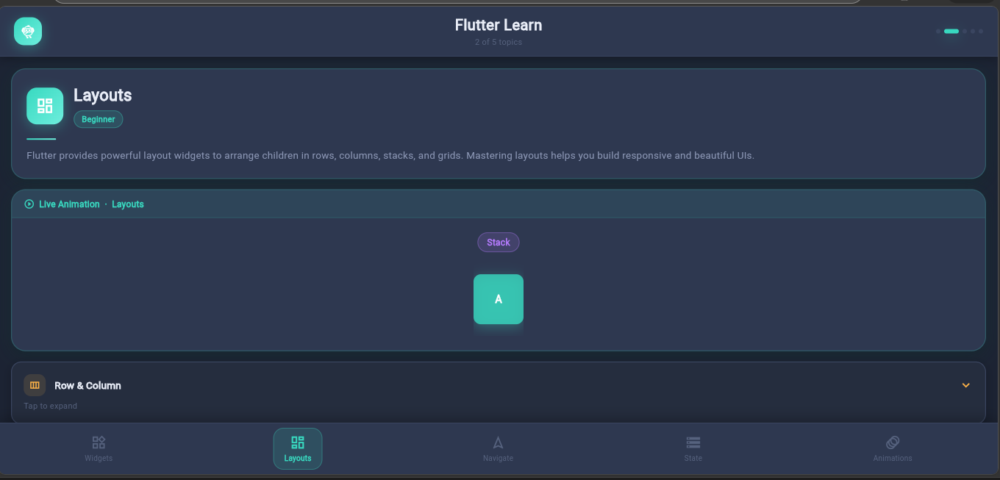

# Flutter Learning App 📚

## 📌 Overview
The Flutter Learning App is an educational mobile application designed to help beginners learn Flutter fundamentals in a structured and interactive way. It contains multiple lessons, examples, and UI demonstrations to improve understanding of Flutter development.

---

## ✨ Features
- 20+ structured Flutter lessons
- Interactive learning modules
- Custom animations for better UX
- Responsive UI for different screen sizes
- Clean navigation between lessons
- Beginner-friendly explanations

---

## 🛠️ Tech Stack
- Flutter
- Dart
- State Management (basic/advanced depending on your implementation)
- Material Design UI

---

## 📸 Screenshots

### 🏠 Home Screen

### 🧩 Widgets Overview

### 🧭 Navigation

### 🎬 Animations

### ⚙️ State Management

### 📐 Layouts

---
## 🚀 How to Run
1. Clone this repository  
2. Run:

flutter pub get

3. Run the app:

flutter run

---

## 📌 Purpose
This project was built for learning Flutter development, UI design, and state management concepts through practical implementation.
## 🚀 How to Run
1. Clone this repository  
2. Run:
